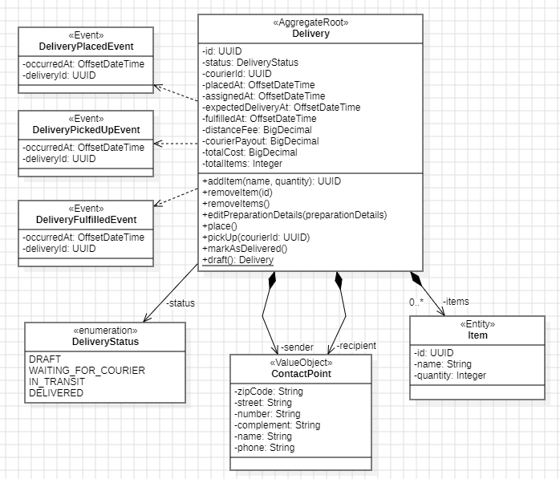

# 🚚 AlgaDelivery - Courier Management


---

## 📦 Descrição

AlgaDelivery é um sistema de **microserviços para gestão de entregas**, construído com Spring Boot e Spring Cloud. Ele integra comunicação síncrona (via REST/OpenFeign) e assíncrona (via Kafka), além de implementar resiliência com Resilience4j. A estrutura inclui serviços de entrega, entregadores, notificações, gateway e discovery.

---

## 🧠 Tecnologias e Frameworks

| Ferramenta / Biblioteca        | Propósito                                                      |
|-------------------------------|----------------------------------------------------------------|
| ☕ **Java 17+**                | Linguagem base                                                 |
| 🌱 **Spring Boot / Spring Cloud** | Construção de microsserviços e integração                      |
| 📬 **Apache Kafka**            | Comunicação assíncrona entre serviços                           |
| 🔗 **OpenFeign**              | Cliente REST declarativo para chamadas entre microserviços     |
| ⚡ **Resilience4j**            | Retry e circuit breaker para resiliência                        |
| 🌐 **Eureka Server & Client** | Descoberta de serviços microserviços                            |
| 🧪 **JUnit / Rest-Assured**   | Testes unitários e de integração                                |
| 🗄️ **PostgreSQL**             | Banco de dados relacional de cada microserviço                  |
| 🛠️ **Docker Compose**         | Inicializar Kafka, PostgreSQL, UI, etc.                         |

---

## 📁 Estrutura do Projeto

```
algadelivery/
├── api-gateway/
├── courier-service/
├── delivery-service/
├── notification-service/
├── config-server/
├── service-discovery/
├── common/
├── compose-kafka.yml
├── docker-compose.yml
└── README.md
```

---

## 🛠️ Como Executar Localmente

### Pré-requisitos
- Docker & Docker Compose
- Java 17 ou superior
- Maven instalado

### Passos:
```bash
git clone <URL_DO_REPO>
cd algadelivery
mvn clean install
docker-compose up -d
docker-compose -f compose-kafka.yml up -d
```

---

## 🔌 Comunicação Entre Microserviços

| Origem             | Destino              | Canal            |
|--------------------|----------------------|------------------|
| api-gateway        | Todos os microsserviços | REST              |
| delivery → courier | `courier-service`     | REST via OpenFeign |
| courier/delivery   | notification-service  | Kafka (evento JSON) |

---

## ⚙️ Configurações e Resiliência (Resilience4j)

- Circuit Breaker via `resilience4j-cb-config.yml`
- Retry automático via `resilience4j-retry-config.yml`

---

## 📐 Modelo de Domínio - Delivery

### 🧱 Aggregate Root: `Delivery`

| Campo | Tipo | Descrição |
|-------|------|-----------|
| `id` | UUID | Identificador da entrega |
| `status` | `DeliveryStatus` | Status atual da entrega |
| `courierId` | UUID | ID do entregador |
| `placedAt`, `assignedAt`, `fulfilledAt` | OffsetDateTime | Datas chave da entrega |
| `distanceFee`, `totalCost`, `courierPayout` | BigDecimal | Cálculos financeiros |
| `totalItems` | Integer | Total de itens da entrega |

#### Métodos:
- `addItem(name, quantity)`
- `removeItem(id)`
- `removeItems()`
- `editPreparationDetails(preparationDetails)`
- `place()`
- `pickUp(courierId)`
- `markAsDelivered()`
- `draft()`

### 📦 Entidades relacionadas

**Item**
```java
- id: UUID
- name: String
- quantity: Integer
```

**ContactPoint** (Value Object)
```java
- zipCode: String
- street: String
- number: String
- complement: String
- name: String
- phone: String
```

### 🧭 Status da Entrega (`DeliveryStatus`)
- `DRAFT`
- `WAITING_FOR_COURIER`
- `IN_TRANSIT`
- `DELIVERED`

### 📡 Eventos de Domínio

| Evento | Quando ocorre |
|--------|----------------|
| `DeliveryPlacedEvent` | Quando a entrega é registrada |
| `DeliveryPickedUpEvent` | Quando o entregador coleta os itens |
| `DeliveryFulfilledEvent` | Quando a entrega é concluída |

---

### 📷 Ilustração do Modelo

![Delivery Domain Model]()

---

## 📞 Contato

- GitHub: [@alexandrealvees](https://github.com/alexandrealvees)

---
